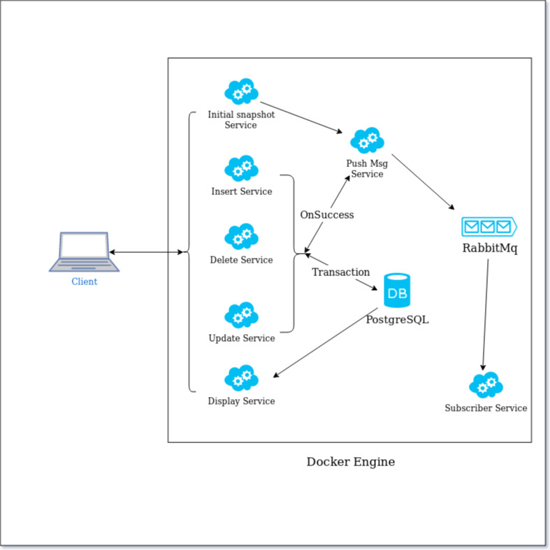

# micro-services-transaction-mngt



To Run this You have to build coustome Image using dockerfile which is at root of the repo. To build 
```sh
$ docker build -t golang:postgres . 
```
It will download extra packages like gorilla mux or lib/pq.
This docker image will be the base image for all other services.

Prerequisite commands to create custome network and volumes(according to compose file)
```sh
$ docker network create my-network
$ docker volume create postgres_data
$ docker volume create rabbitmq_data
```

after that run
```sh
$ docker-compose build
$ docker-compose up
```
or
```sh
$docker-compose up --build
```
To see the opening ports
```sh
$docker ps
```


